# BÀI THỰC HÀNH 1 (BTH1): MÔ TẢ ĐỀ TÀI & MÔ HÌNH PHÂN RÃ CHỨC NĂNG (BFD)

**Môn học:** Phân tích thiết kế hướng đối tượng (OOAD) - SGU HK1 NH2025-2026  
**Tên đề tài:** Hệ thống Quản lý Cụm Sân Thể Thao và Đặt Sân Trực Tuyến  
*(Sports Complex Management & Online Court Booking System)*  

---

## PHẦN 1: MÔ TẢ ĐỀ TÀI CHI TIẾT

### 1.1. Bối cảnh và Lý do chọn đề tài
Trong những năm gần đây, phong trào rèn luyện sức khỏe thông qua các môn thể thao đối kháng như **Pickleball, Cầu lông, Bóng đá mini, Tennis** phát triển bùng nổ tại các đô thị lớn. Nhu cầu thuê sân chơi theo giờ vào các khung giờ vàng (17h - 22h) và các ngày cuối tuần tăng cao đột biến.

Tuy nhiên, phần lớn các cụm sân thể thao hiện nay vẫn đang vận hành theo cách truyền thống:
* Đặt sân qua tin nhắn Zalo, gọi điện thoại, hoặc ghi chép sổ sách/file Excel thủ công.
* Dễ xảy ra tình trạng **trùng lịch (Overbooking)**, bỏ quên lịch hẹn của khách hoặc tranh chấp giờ chơi.
* Khách hàng muốn đặt sân phải mất thời gian nhắn tin chờ chủ sân kiểm tra lịch trống từng sân một.
* Khó quản lý các dịch vụ đi kèm tại sân: Cho thuê vợt/bóng, bán nước giải khát, thu tiền cọc, dẫn đến thất thoát doanh thu.
* Thiếu số liệu thống kê về công suất lấp đầy sân (Occupancy Rate) để chủ sân điều chỉnh chính sách giá hợp lý theo khung giờ.

Xuất phát từ thực tiễn trên, nhóm quyết định xây dựng đề tài **"Hệ thống Quản lý Cụm Sân Thể Thao và Đặt Sân Trực Tuyến"** nhằm tin học hóa toàn diện quy trình vận hành và mang lại trải nghiệm tiện lợi cho người chơi thể thao.

---

### 1.2. Mục tiêu của hệ thống
1. **Đối với Khách hàng (Người chơi thể thao):**
   * Tra cứu trực quan tình trạng sân trống theo ngày, theo môn thể thao và khung giờ trên lưới thời gian thực (Timeline Grid).
   * Đặt sân và thanh toán cọc trực tuyến nhanh chóng, nhận mã QR check-in ngay lập tức.
   * Hỗ trợ đặt lịch cố định hàng tháng cho các câu lạc bộ (CLB) với chính sách chiết khấu ưu đãi.
   * Quản lý lịch sử đặt chỗ, hủy lịch theo quy định hoàn cọc và tích lũy điểm hội viên.
2. **Đối với Nhân viên Lễ tân / Thu ngân (Tại sân):**
   * Theo dõi sơ đồ toàn bộ các sân theo thời gian thực với màu sắc nhận diện trạng thái (Trống, Đã đặt, Đang chơi, Chờ thanh toán, Bảo trì).
   * Check-in nhanh cho khách bằng cách quét mã QR.
   * Ghi nhận dịch vụ phát sinh tại chỗ: Cho thuê vợt, bóng, mua nước uống vào hóa đơn của từng sân.
   * Tính phụ phí quá giờ tự động khi khách chơi lố giờ đăng ký.
   * In hóa đơn tổng hợp nhanh chóng, chính xác.
3. **Đối với Chủ sân / Quản lý (Admin / Manager):**
   * Cấu hình linh hoạt bảng giá theo ma trận: Giờ thường (Standard Hours) vs Giờ cao điểm (Peak Hours), ngày thường vs Thứ 7/Chủ nhật/Ngày lễ.
   * Quản lý kho hàng hóa, dụng cụ cho thuê, theo dõi hỏng hóc và tồn kho.
   * Quản lý thông tin khách hàng, thẻ hội viên, chính sách khuyến mãi/voucher.
   * Báo cáo thống kê trực quan: Doanh thu theo ca/ngày/tháng, tỷ lệ khai thác từng sân, mặt hàng bán chạy nhất.

---

### 1.3. Các tác nhân tham gia hệ thống (Actors)
1. **Khách hàng vãng lai (Guest / Visitor):** Người dùng chưa đăng nhập, có thể tra cứu thông tin cụm sân, xem giá vé, xem bảng giờ trống.
2. **Khách hàng thành viên (Member Customer):** Người chơi đã đăng ký tài khoản, có thể đặt sân trực tuyến, quản lý lịch đặt, tích điểm hội viên.
3. **Nhân viên lễ tân / Thu ngân (Receptionist / Staff):** Người trực tại quầy tiếp đón khách, check-in, gán sân, bán nước/thuê dụng cụ, lập hóa đơn thanh toán.
4. **Nhân viên thủ kho (Inventory Staff):** Quản lý nhập hàng dụng cụ/nước uống, kiểm kê tài sản cho thuê, báo cáo hao mòn hư hại.
5. **Chủ sân / Quản trị viên (Manager / Administrator):** Thiết lập danh mục sân, cấu hình bảng giá, quản lý tài khoản nhân viên, xem báo cáo thống kê kinh doanh.

---

### 1.4. Quy trình nghiệp vụ chính

#### Quy trình 1: Đặt sân vãng lai trực tuyến (Online Booking Flow)
1. Khách hàng truy cập website/ứng dụng, chọn cụm sân, môn thể thao (VD: Pickleball) và ngày chơi.
2. Hệ thống hiển thị ma trận lịch trống (mỗi cột là 1 sân, mỗi hàng là 1 khung giờ 60 phút).
3. Khách hàng click chọn các khung giờ còn trống (Slot xanh).
4. Hệ thống kiểm tra ràng buộc (Availability Check) và thực hiện **khóa tạm thời slot trong 10 phút (Lock Timeout)** để tránh người khác đặt trùng.
5. Khách hàng chọn phương thức thanh toán tiền cọc (tối thiểu 30% tổng tiền giờ).
6. Sau khi thanh toán thành công, hệ thống chuyển trạng thái sân sang `Booked`, tạo mã `Booking_Code` và gửi mã QR xác nhận qua Email/SMS cho khách.

#### Quy trình 2: Đặt lịch cố định theo tháng (Monthly Subscription Booking)
1. Đại diện câu lạc bộ chọn lịch thi đấu cố định (VD: Tối Thứ 2 - 4 - 6 từ 18:00 đến 20:00 suốt cả tháng 10).
2. Hệ thống tự động quét lịch của tất cả các ngày thỏa mãn trong tháng:
   * Nếu có ngày bị trùng lịch đã đặt từ trước, hệ thống cảnh báo và gợi ý đổi sang sân lân cận cùng loại.
3. Hệ thống tạo hợp đồng thuê sân định kỳ kèm mức chiết khấu hội viên (ví dụ giảm 10%).
4. Khách hàng thanh toán tiền cọc theo kỳ và được cố định giữ sân hàng tuần.

#### Quy trình 3: Check-in và Vận hành tại sân (At-court Operations)
1. Khách hàng đến sân, xuất trình mã QR tại quầy tiếp tân.
2. Lễ tân quét mã QR: Hệ thống hiển thị thông tin đặt sân, chuyển trạng thái sân trên màn hình trực quan sang `Occupied (Đang chơi)`.
3. Khách hàng mượn/thuê 2 vợt Pickleball và lấy 4 chai nước suối:
   * Lễ tân chọn chức năng "Thêm dịch vụ", quét mã sản phẩm; hệ thống tự động cộng dồn vào phiếu chi tiết của sân đó.
4. Khi đến giờ hết hạn: Hệ thống phát tín hiệu cảnh báo trên màn hình lễ tân. Nếu khách chơi tiếp quá 15 phút, hệ thống tự động kích hoạt tính năng phụ thu quá giờ (Overtime Surcharge).

#### Quy trình 4: Thanh toán và Xuất hóa đơn tổng hợp (Checkout & Invoicing)
1. Khách kết thúc giờ chơi và ra quầy làm thủ tục.
2. Lễ tân kiểm tra dụng cụ thuê trả lại (có hỏng hóc/mất mát hay không).
3. Hệ thống tổng hợp chi phí:
   $$\text{Tiền thanh toán} = \text{Tiền sân} + \text{Phụ phí quá giờ} + \text{Tiền thuê đồ} + \text{Tiền nước uống} - \text{Tiền cọc} - \text{Khuyến mãi}$$
4. Khách hàng thanh toán phần còn lại (Tiền mặt / Chuyển khoản QR ngân hàng).
5. Hệ thống in hóa đơn, tích lũy điểm vào tài khoản hội viên và cập nhật trạng thái sân thành `Available (Sẵn sàng)`.

---

## PHẦN 2: MÔ HÌNH PHÂN RÃ CHỨC NĂNG (BFD - BUSINESS FUNCTION DIAGRAM)

### 2.1. Cấu trúc cây phân rã chức năng (Text Tree Format)

```text
HỆ THỐNG QUẢN LÝ CỤM SÂN THỂ THAO VÀ ĐẶT SÂN
│
├── 1.0 QUẢN LÝ DANH MỤC & CẤU HÌNH HỆ THỐNG
│   ├── 1.1 Quản lý danh mục cụm sân & sân
│   │   ├── 1.1.1 Thêm sân mới
│   │   ├── 1.1.2 Cập nhật thông tin sân (Tên sân, quy cách)
│   │   └── 1.1.3 Chuyển trạng thái sân (Hoạt động, Bảo trì, Tạm đóng)
│   ├── 1.2 Phân loại sân (Sân đơn, Sân đôi, Sân trong nhà, Sân ngoài trời)
│   ├── 1.3 Cấu hình bảng giá theo khung giờ
│   │   ├── 1.3.1 Thiết lập giá giờ tiêu chuẩn (Giờ hành chính)
│   │   └── 1.3.2 Thiết lập giá giờ cao điểm (Peak hours 17h-22h)
│   └── 1.4 Cấu hình bảng giá phụ thu & quy định
│       ├── 1.4.1 Phụ thu cuối tuần / Ngày nghỉ lễ
│       ├── 1.4.2 Phụ thu chơi quá giờ (Overtime policy)
│       └── 1.4.3 Thiết lập quy định hoàn hủy cọc (% cọc theo thời gian hủy)
│
├── 2.0 QUẢN LÝ ĐẶT SÂN & LỊCH THI ĐẤU
│   ├── 2.1 Tra cứu lịch sân trống
│   ├── 2.2 Đặt sân theo lượt (Vãng lai)
│   │   ├── 2.2.1 Chọn sân & khung giờ mong muốn
│   │   ├── 2.2.2 Giữ chỗ tạm thời (Khóa slot 10 phút)
│   │   ├── 2.2.3 Xác nhận đặt & Thu tiền đặt cọc
│   │   └── 2.2.4 Phát hành mã đặt sân & Mã QR nhận diện
│   ├── 2.3 Đặt lịch sân cố định theo tháng (Cho Câu lạc bộ / Doanh nghiệp)
│   │   ├── 2.3.1 Chọn lịch lặp lại hàng tuần theo tháng
│   │   ├── 2.3.2 Kiểm tra xung đột lịch và tự động điều phối sân
│   │   └── 2.3.3 Ký hợp đồng thuê sân định kỳ
│   ├── 2.4 Hủy đặt sân & Xử lý hoàn cọc theo quy định
│   └── 2.5 Điều chỉnh lịch đặt (Đổi sân, Dời ngày/giờ thi đấu)
│
├── 3.0 QUẢN LÝ VẬN HÀNH TẠI SÂN (LỄ TÂN & POS)
│   ├── 3.1 Tiếp nhận khách & Check-in
│   │   ├── 3.1.1 Quét mã QR xác thực khách đặt trước
│   │   ├── 3.1.2 Mở sân trực tiếp cho khách vào chơi ngay tại quầy
│   │   └── 3.1.3 Đổi trạng thái sân sang "Đang sử dụng"
│   ├── 3.2 Ghi nhận cho thuê dụng cụ (Vợt, bóng, giày, lưới)
│   ├── 3.3 Bán lẻ nước giải khát & Phụ kiện thể thao tại chỗ
│   ├── 3.4 Theo dõi thời lượng & Cảnh báo thời gian thực
│   │   ├── 3.4.1 Cảnh báo sân sắp hết giờ trước 10 phút
│   │   └── 3.4.2 Tự động ghi nhận giờ quá hạn và phụ thu
│   └── 3.5 Lập phiếu thanh toán tổng hợp & In hóa đơn
│
├── 4.0 QUẢN LÝ KHO HÀNG HÓA & TÀI SẢN
│   ├── 4.1 Quản lý danh mục hàng hóa (Nước, đồ ăn nhẹ, phụ kiện)
│   ├── 4.2 Lập phiếu nhập kho từ nhà cung cấp
│   ├── 4.3 Quản lý danh mục dụng cụ cho thuê & Kiểm kê định kỳ
│   ├── 4.4 Ghi nhận hư hỏng, đền bù mất mát dụng cụ
│   └── 4.5 Cảnh báo tồn kho dưới định mức an toàn
│
└── 5.0 QUẢN LÝ KHÁCH HÀNG & BÁO CÁO THỐNG KÊ
    ├── 5.1 Quản lý hồ sơ khách hàng & Thẻ hội viên (Tích lũy điểm)
    ├── 5.2 Quản lý chương trình khuyến mãi & Mã giảm giá (Voucher)
    ├── 5.3 Báo cáo doanh thu
    │   ├── 5.3.1 Báo cáo doanh thu tiền sân (Theo ngày/tháng/loại sân)
    │   ├── 5.3.2 Báo cáo doanh thu dịch vụ phụ trợ (Nước uống, thuê vợt)
    │   └── 5.3.3 Báo cáo doanh thu theo hình thức thanh toán (Tiền mặt/Chuyển khoản)
    ├── 5.4 Báo cáo hiệu suất lấp đầy sân (Tỷ lệ khai thác theo giờ)
    └── 5.5 Quản trị hệ thống & Phân quyền tài khoản
        ├── 5.5.1 Quản lý người dùng (Admin, Quản lý, Lễ tân, Khách hàng)
        └── 5.5.2 Phân quyền chức năng theo vai trò
```

---

### 2.2. Sơ đồ BFD trực quan (Mermaid Diagram)

Dưới đây là mã sơ đồ Mermaid để xem trực tiếp hoặc nhúng vào báo cáo:

```mermaid
graph TD
    Root["HỆ THỐNG QUẢN LÝ CỤM SÂN THỂ THAO & ĐẶT SÂN"]

    Root --> F1["1.0 QUẢN LÝ DANH MỤC & CẤU HÌNH"]
    Root --> F2["2.0 QUẢN LÝ ĐẶT SÂN & LỊCH"]
    Root --> F3["3.0 QUẢN LÝ VẬN HÀNH TẠI SÂN"]
    Root --> F4["4.0 QUẢN LÝ KHO & DỤNG CỤ"]
    Root --> F5["5.0 KHÁCH HÀNG & BÁO CÁO"]

    %% 1.0
    F1 --> F11["1.1 QL Danh mục sân"]
    F1 --> F12["1.2 Phân loại sân"]
    F1 --> F13["1.3 Cấu hình bảng giá theo giờ"]
    F1 --> F14["1.4 Cấu hình phụ thu & hoàn cọc"]

    %% 2.0
    F2 --> F21["2.1 Tra cứu lịch sân trống"]
    F2 --> F22["2.2 Đặt sân theo lượt vãng lai"]
    F2 --> F23["2.3 Đặt lịch sân cố định tháng"]
    F2 --> F24["2.4 Hủy đặt sân & Hoàn cọc"]
    F2 --> F25["2.5 Dời lịch & Đổi sân"]

    %% 3.0
    F3 --> F31["3.1 Tiếp nhận & Check-in QR"]
    F3 --> F32["3.2 Quản lý thuê dụng cụ"]
    F3 --> F33["3.3 Bán lẻ nước & phụ kiện"]
    F3 --> F34["3.4 Theo dõi giờ & Cảnh báo"]
    F3 --> F35["3.5 Thanh toán & In hóa đơn"]

    %% 4.0
    F4 --> F41["4.1 QL Danh mục sản phẩm"]
    F4 --> F42["4.2 Nhập kho nhà cung cấp"]
    F4 --> F43["4.3 Kiểm kê tài sản cho thuê"]
    F4 --> F44["4.4 Ghi nhận đền bù hư hỏng"]
    F4 --> F45["4.5 Cảnh báo tồn kho an toàn"]

    %% 5.0
    F5 --> F51["5.1 QL Khách hàng & Thẻ hội viên"]
    F5 --> F52["5.2 QL Khuyến mãi & Voucher"]
    F5 --> F53["5.3 Báo cáo doanh thu đa chiều"]
    F5 --> F54["5.4 Báo cáo tỷ lệ lấp đầy sân"]
    F5 --> F55["5.5 Phân quyền người dùng & Bảo mật"]
```



---

## PHẦN 3: ĐỐI CHIẾU TIÊU CHÍ CHẤM ĐIỂM OOAD SGU

1. **Tính đối tượng (Object-Oriented):** 
   * Tách biệt rõ ràng các thực thể: `Court` (Sân), `TimeSlot` (Khung giờ), `Booking` (Đơn đặt), `RentalOrder` (Thuê đồ), `Invoice` (Hóa đơn), `Product` (Hàng hóa), `Customer` (Khách hàng).
   * Áp dụng kế thừa đa hình trên lớp Sân và quy tắc tính giá giờ cao điểm/cuối tuần.
2. **Tính khả thi của đồ án:**
   * Dễ dàng cài đặt bằng mô hình 3 lớp (Presentation, Business Logic, Data Access) trên WinForms/WPF (C#) hoặc Web (React + Spring Boot / ASP.NET Core).
   * Phù hợp để vấn đáp trực tiếp trên laptop: Thầy/cô yêu cầu *"Thêm một loại sân mới (Sân Tennis)"* hoặc *"Đổi mức phụ phí cuối tuần từ 20% lên 30%"* có thể live-code sửa trong 2 phút.
