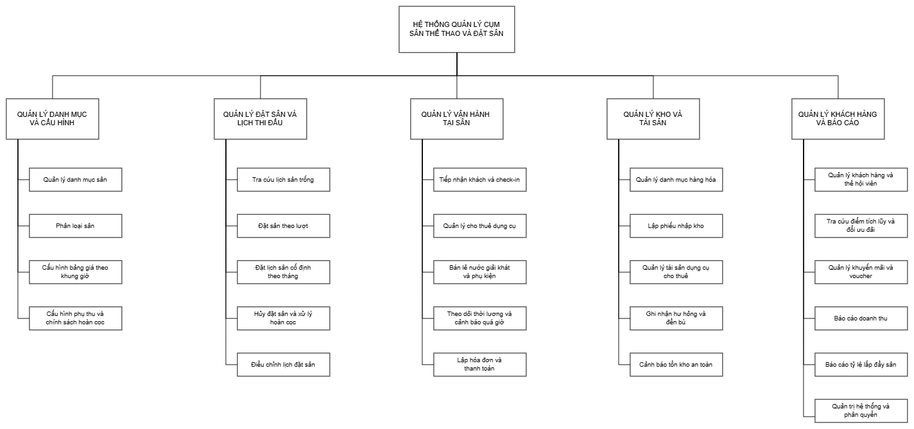

# BÀI THỰC HÀNH 1 (BTH1): MÔ TẢ ĐỀ TÀI & MÔ HÌNH PHÂN RÃ CHỨC NĂNG (BFD)

**Môn học:** Phân tích thiết kế hướng đối tượng (OOAD) - SGU HK1 NH2025-2026  
**Tên đề tài:** Hệ thống Quản lý Cụm Sân Thể Thao và Đặt Sân Trực Tuyến  
*(Sports Complex Management & Online Court Booking System)*  

---

## PHẦN 1: MÔ TẢ ĐỀ TÀI CHI TIẾT

### 1.1. Bối cảnh và Lý do chọn đề tài
Trong những năm gần đây, phong trào rèn luyện sức khỏe thông qua các môn thể thao đối kháng như **Pickleball, Cầu lông, Bóng đá mini, Tennis** phát triển bùng nổ tại các đô thị lớn. Nhu cầu thuê sân chơi theo giờ vào các khung giờ vàng (17h - 22h) và các ngày cuối tuần tăng cao đột biến.

Tuy nhiên, phần lớn các cụm sân thể thao hiện nay vẫn đang vận hành theo cách truyền thống:
* Đặt sân qua tin nhắn Zalo, gọi điện thoại, hoặc ghi chép sổ sách/file Excel thủ công.
* Dễ xảy ra tình trạng **trùng lịch (Overbooking)**, bỏ quên lịch hẹn của khách hoặc tranh chấp giờ chơi.
* Khách hàng muốn đặt sân phải mất thời gian nhắn tin chờ chủ sân kiểm tra lịch trống từng sân một.
* Khó quản lý các dịch vụ đi kèm tại sân: Cho thuê vợt/bóng, bán nước giải khát, thu tiền cọc, dẫn đến thất thoát doanh thu.
* Thiếu số liệu thống kê về công suất lấp đầy sân (Occupancy Rate) để chủ sân điều chỉnh chính sách giá hợp lý theo khung giờ.

Xuất phát từ thực tiễn trên, nhóm quyết định xây dựng đề tài **"Hệ thống Quản lý Cụm Sân Thể Thao và Đặt Sân Trực Tuyến"** nhằm tin học hóa toàn diện quy trình vận hành và mang lại trải nghiệm tiện lợi cho người chơi thể thao.

---

### 1.2. Mục tiêu của hệ thống
1. **Đối với Khách hàng (Người chơi thể thao):**
   * Tra cứu trực quan tình trạng sân trống theo ngày, theo môn thể thao và khung giờ trên lưới thời gian thực (Timeline Grid).
   * Đặt sân và thanh toán cọc trực tuyến nhanh chóng, nhận mã QR check-in ngay lập tức.
   * Hỗ trợ đặt lịch cố định hàng tháng cho các câu lạc bộ (CLB) với chính sách chiết khấu ưu đãi.
   * Quản lý lịch sử đặt chỗ, hủy lịch theo quy định hoàn cọc và tích lũy điểm hội viên.
2. **Đối với Nhân viên Lễ tân / Thu ngân (Tại sân):**
   * Theo dõi sơ đồ toàn bộ các sân theo thời gian thực với màu sắc nhận diện trạng thái (Trống, Đã đặt, Đang chơi, Chờ thanh toán, Bảo trì).
   * Check-in nhanh cho khách bằng cách quét mã QR.
   * Ghi nhận dịch vụ phát sinh tại chỗ: Cho thuê vợt, bóng, mua nước uống vào hóa đơn của từng sân.
   * Tính phụ phí quá giờ tự động khi khách chơi lố giờ đăng ký.
   * In hóa đơn tổng hợp nhanh chóng, chính xác.
3. **Đối với Chủ sân / Quản lý (Admin / Manager):**
   * Cấu hình linh hoạt bảng giá theo ma trận: Giờ thường (Standard Hours) vs Giờ cao điểm (Peak Hours), ngày thường vs Thứ 7/Chủ nhật/Ngày lễ.
   * Quản lý kho hàng hóa, dụng cụ cho thuê, theo dõi hỏng hóc và tồn kho.
   * Quản lý thông tin khách hàng, thẻ hội viên, chính sách khuyến mãi/voucher.
   * Báo cáo thống kê trực quan: Doanh thu theo ca/ngày/tháng, tỷ lệ khai thác từng sân, mặt hàng bán chạy nhất.

---

### 1.3. Các tác nhân tham gia hệ thống (Actors)
1. **Khách hàng vãng lai (Guest / Visitor):** Người dùng chưa đăng nhập, có thể tra cứu thông tin cụm sân, xem giá vé, xem bảng giờ trống.
2. **Khách hàng thành viên (Member Customer):** Người chơi đã đăng ký tài khoản, có thể đặt sân trực tuyến, quản lý lịch đặt, tích điểm hội viên.
3. **Nhân viên lễ tân / Thu ngân (Receptionist / Staff):** Người trực tại quầy tiếp đón khách, check-in, gán sân, bán nước/thuê dụng cụ, lập hóa đơn thanh toán.
4. **Nhân viên thủ kho (Inventory Staff):** Quản lý nhập hàng dụng cụ/nước uống, kiểm kê tài sản cho thuê, báo cáo hao mòn hư hại.
5. **Chủ sân / Quản trị viên (Manager / Administrator):** Thiết lập danh mục sân, cấu hình bảng giá, quản lý tài khoản nhân viên, xem báo cáo thống kê kinh doanh.

---

### 1.4. Quy trình nghiệp vụ chính

#### Quy trình 1: Đặt sân vãng lai trực tuyến (Online Booking Flow)
1. Khách hàng truy cập website/ứng dụng, chọn cụm sân, môn thể thao (VD: Pickleball) và ngày chơi.
2. Hệ thống hiển thị ma trận lịch trống (mỗi cột là 1 sân, mỗi hàng là 1 khung giờ 60 phút).
3. Khách hàng click chọn các khung giờ còn trống (Slot xanh).
4. Hệ thống kiểm tra ràng buộc (Availability Check) và thực hiện **khóa tạm thời slot trong 10 phút (Lock Timeout)** để tránh người khác đặt trùng.
5. Khách hàng chọn phương thức thanh toán tiền cọc (tối thiểu 30% tổng tiền giờ).
6. Sau khi thanh toán thành công, hệ thống chuyển trạng thái sân sang `Booked`, tạo mã `Booking_Code` và gửi mã QR xác nhận qua Email/SMS cho khách.

#### Quy trình 2: Đặt lịch cố định theo tháng (Monthly Subscription Booking)
1. Đại diện câu lạc bộ chọn lịch thi đấu cố định (VD: Tối Thứ 2 - 4 - 6 từ 18:00 đến 20:00 suốt cả tháng 10).
2. Hệ thống tự động quét lịch của tất cả các ngày thỏa mãn trong tháng:
   * Nếu có ngày bị trùng lịch đã đặt từ trước, hệ thống cảnh báo và gợi ý đổi sang sân lân cận cùng loại.
3. Hệ thống tạo hợp đồng thuê sân định kỳ kèm mức chiết khấu hội viên (ví dụ giảm 10%).
4. Khách hàng thanh toán tiền cọc theo kỳ và được cố định giữ sân hàng tuần.

#### Quy trình 3: Check-in và Vận hành tại sân (At-court Operations)
1. Khách hàng đến sân, xuất trình mã QR tại quầy tiếp tân.
2. Lễ tân quét mã QR: Hệ thống hiển thị thông tin đặt sân, chuyển trạng thái sân trên màn hình trực quan sang `Occupied (Đang chơi)`.
3. Khách hàng mượn/thuê 2 vợt Pickleball và lấy 4 chai nước suối:
   * Lễ tân chọn chức năng "Thêm dịch vụ", quét mã sản phẩm; hệ thống tự động cộng dồn vào phiếu chi tiết của sân đó.
4. Khi đến giờ hết hạn: Hệ thống phát tín hiệu cảnh báo trên màn hình lễ tân. Nếu khách chơi tiếp quá 15 phút, hệ thống tự động kích hoạt tính năng phụ thu quá giờ (Overtime Surcharge).

#### Quy trình 4: Thanh toán và Xuất hóa đơn tổng hợp (Checkout & Invoicing)
1. Khách kết thúc giờ chơi và ra quầy làm thủ tục.
2. Lễ tân kiểm tra dụng cụ thuê trả lại (có hỏng hóc/mất mát hay không).
3. Hệ thống tổng hợp chi phí:
   $$\text{Tiền thanh toán} = \text{Tiền sân} + \text{Phụ phí quá giờ} + \text{Tiền thuê đồ} + \text{Tiền nước uống} - \text{Tiền cọc} - \text{Khuyến mãi}$$
4. Khách hàng thanh toán phần còn lại (Tiền mặt / Chuyển khoản QR ngân hàng).
5. Hệ thống in hóa đơn, tích lũy điểm vào tài khoản hội viên và cập nhật trạng thái sân thành `Available (Sẵn sàng)`.

---

## PHẦN 2: MÔ HÌNH PHÂN RÃ CHỨC NĂNG (BFD - BUSINESS FUNCTION DIAGRAM)

### 2.1. Cấu trúc cây phân rã chức năng (Text Tree Format)

```text
HỆ THỐNG QUẢN LÝ CỤM SÂN THỂ THAO VÀ ĐẶT SÂN
│
├── 1.0 QUẢN LÝ DANH MỤC VÀ CẤU HÌNH
│   ├── 1.1 Quản lý danh mục sân
│   │   ├── 1.1.1 Thêm sân mới
│   │   ├── 1.1.2 Cập nhật thông tin sân
│   │   └── 1.1.3 Chuyển trạng thái sân
│   ├── 1.2 Quản lý loại sân và môn thể thao
│   │   ├── 1.2.1 Thiết lập loại sân
│   │   └── 1.2.2 Thiết lập môn thể thao
│   ├── 1.3 Cấu hình bảng giá theo khung giờ
│   │   ├── 1.3.1 Thiết lập giá giờ tiêu chuẩn
│   │   └── 1.3.2 Thiết lập giá giờ cao điểm
│   └── 1.4 Cấu hình phụ thu và chính sách hoàn cọc
│       ├── 1.4.1 Cấu hình phụ thu cuối tuần và ngày lễ
│       ├── 1.4.2 Cấu hình phụ thu quá giờ chơi
│       └── 1.4.3 Cấu hình tỷ lệ hoàn cọc
│
├── 2.0 QUẢN LÝ ĐẶT SÂN VÀ LỊCH THI ĐẤU
│   ├── 2.1 Tra cứu lịch sân trống
│   ├── 2.2 Đặt sân theo lượt
│   │   ├── 2.2.1 Khóa slot giữ chỗ tạm thời
│   │   ├── 2.2.2 Thanh toán tiền cọc trực tuyến
│   │   └── 2.2.3 Phát hành mã đặt sân và mã QR
│   ├── 2.3 Đặt lịch sân cố định theo tháng
│   │   └── 2.3.1 Quét xung đột và điều phối lịch tháng
│   ├── 2.4 Hủy đặt sân và xử lý hoàn cọc
│   └── 2.5 Điều chỉnh lịch đặt sân
│
├── 3.0 QUẢN LÝ VẬN HÀNH TẠI SÂN
│   ├── 3.1 Tiếp nhận khách và check-in
│   │   ├── 3.1.1 Quét mã QR xác thực khách đặt trước
│   │   └── 3.1.2 Mở sân trực tiếp cho khách vãng lai
│   ├── 3.2 Quản lý cho thuê dụng cụ
│   │   ├── 3.2.1 Lập phiếu thuê dụng cụ
│   │   ├── 3.2.2 Kiểm tra hoàn trả dụng cụ
│   │   └── 3.2.3 Ghi nhận bồi thường hư hại dụng cụ
│   ├── 3.3 Bán lẻ nước giải khát và phụ kiện
│   ├── 3.4 Theo dõi thời lượng và cảnh báo quá giờ
│   └── 3.5 Lập hóa đơn và thanh toán
│       ├── 3.5.1 Tính phụ phí quá giờ chơi
│       └── 3.5.2 Áp dụng ưu đãi và voucher
│
├── 4.0 QUẢN LÝ KHO VÀ TÀI SẢN
│   ├── 4.1 Quản lý danh mục hàng hóa
│   ├── 4.2 Lập phiếu nhập kho
│   ├── 4.3 Quản lý tài sản dụng cụ cho thuê
│   ├── 4.4 Ghi nhận hư hỏng và đền bù
│   └── 4.5 Cảnh báo tồn kho an toàn
│
└── 5.0 QUẢN LÝ KHÁCH HÀNG VÀ BÁO CÁO
    ├── 5.1 Quản lý khách hàng và thẻ hội viên
    │   ├── 5.1.1 Đăng ký và nâng hạng thẻ hội viên
    │   └── 5.1.2 Tra cứu điểm tích lũy và đổi ưu đãi
    ├── 5.2 Quản lý khuyến mãi và voucher
    ├── 5.3 Báo cáo doanh thu
    │   ├── 5.3.1 Báo cáo doanh thu tiền sân
    │   ├── 5.3.2 Báo cáo doanh thu dịch vụ phụ trợ
    │   └── 5.3.3 Báo cáo doanh thu theo hình thức thanh toán
    ├── 5.4 Báo cáo tỷ lệ lấp đầy sân
    └── 5.5 Quản trị hệ thống và phân quyền
```

---

### 2.2. Sơ đồ BFD trực quan (Business Function Diagram)

```mermaid
graph TD
    Root["HỆ THỐNG QUẢN LÝ CỤM SÂN THỂ THAO VÀ ĐẶT SÂN"]

    Root --> F1["1.0 QUẢN LÝ DANH MỤC VÀ CẤU HÌNH"]
    Root --> F2["2.0 QUẢN LÝ ĐẶT SÂN VÀ LỊCH THI ĐẤU"]
    Root --> F3["3.0 QUẢN LÝ VẬN HÀNH TẠI SÂN"]
    Root --> F4["4.0 QUẢN LÝ KHO VÀ TÀI SẢN"]
    Root --> F5["5.0 QUẢN LÝ KHÁCH HÀNG VÀ BÁO CÁO"]

    %% 1.0
    F1 --> F11["1.1 Quản lý danh mục sân"]
    F11 --> F111["1.1.1 Thêm sân mới"]
    F11 --> F112["1.1.2 Cập nhật thông tin sân"]
    F11 --> F113["1.1.3 Chuyển trạng thái sân"]

    F1 --> F12["1.2 Quản lý loại sân và môn thể thao"]
    F12 --> F121["1.2.1 Thiết lập loại sân"]
    F12 --> F122["1.2.2 Thiết lập môn thể thao"]

    F1 --> F13["1.3 Cấu hình bảng giá theo khung giờ"]
    F13 --> F131["1.3.1 Thiết lập giá giờ tiêu chuẩn"]
    F13 --> F132["1.3.2 Thiết lập giá giờ cao điểm"]

    F1 --> F14["1.4 Cấu hình phụ thu và chính sách hoàn cọc"]
    F14 --> F141["1.4.1 Cấu hình phụ thu cuối tuần và ngày lễ"]
    F14 --> F142["1.4.2 Cấu hình phụ thu quá giờ chơi"]
    F14 --> F143["1.4.3 Cấu hình tỷ lệ hoàn cọc"]

    %% 2.0
    F2 --> F21["2.1 Tra cứu lịch sân trống"]

    F2 --> F22["2.2 Đặt sân theo lượt"]
    F22 --> F221["2.2.1 Khóa slot giữ chỗ tạm thời"]
    F22 --> F222["2.2.2 Thanh toán tiền cọc trực tuyến"]
    F22 --> F223["2.2.3 Phát hành mã đặt sân và mã QR"]

    F2 --> F23["2.3 Đặt lịch sân cố định theo tháng"]
    F23 --> F231["2.3.1 Quét xung đột và điều phối lịch tháng"]

    F2 --> F24["2.4 Hủy đặt sân và xử lý hoàn cọc"]
    F2 --> F25["2.5 Điều chỉnh lịch đặt sân"]

    %% 3.0
    F3 --> F31["3.1 Tiếp nhận khách và check-in"]
    F31 --> F311["3.1.1 Quét mã QR xác thực khách đặt trước"]
    F31 --> F312["3.1.2 Mở sân trực tiếp cho khách vãng lai"]

    F3 --> F32["3.2 Quản lý cho thuê dụng cụ"]
    F32 --> F321["3.2.1 Lập phiếu thuê dụng cụ"]
    F32 --> F322["3.2.2 Kiểm tra hoàn trả dụng cụ"]
    F32 --> F323["3.2.3 Ghi nhận bồi thường hư hại dụng cụ"]

    F3 --> F33["3.3 Bán lẻ nước giải khát và phụ kiện"]
    F3 --> F34["3.4 Theo dõi thời lượng và cảnh báo quá giờ"]

    F3 --> F35["3.5 Lập hóa đơn và thanh toán"]
    F35 --> F351["3.5.1 Tính phụ phí quá giờ chơi"]
    F35 --> F352["3.5.2 Áp dụng ưu đãi và voucher"]

    %% 4.0
    F4 --> F41["4.1 Quản lý danh mục hàng hóa"]
    F4 --> F42["4.2 Lập phiếu nhập kho"]
    F4 --> F43["4.3 Quản lý tài sản dụng cụ cho thuê"]
    F4 --> F44["4.4 Ghi nhận hư hỏng và đền bù"]
    F4 --> F45["4.5 Cảnh báo tồn kho an toàn"]

    %% 5.0
    F5 --> F51["5.1 Quản lý khách hàng và thẻ hội viên"]
    F51 --> F511["5.1.1 Đăng ký và nâng hạng thẻ hội viên"]
    F51 --> F512["5.1.2 Tra cứu điểm tích lũy và đổi ưu đãi"]

    F5 --> F52["5.2 Quản lý khuyến mãi và voucher"]

    F5 --> F53["5.3 Báo cáo doanh thu"]
    F53 --> F531["5.3.1 Báo cáo doanh thu tiền sân"]
    F53 --> F532["5.3.2 Báo cáo doanh thu dịch vụ phụ trợ"]
    F53 --> F533["5.3.3 Báo cáo doanh thu theo hình thức thanh toán"]

    F5 --> F54["5.4 Báo cáo tỷ lệ lấp đầy sân"]
    F5 --> F55["5.5 Quản trị hệ thống và phân quyền"]

    %% Styling
    classDef root fill:#003366,stroke:#001F3F,stroke-width:2px,color:#fff,font-weight:bold;
    classDef level1 fill:#0066CC,stroke:#004C99,stroke-width:2px,color:#fff,font-weight:bold;
    classDef level2 fill:#E6F0FA,stroke:#0066CC,stroke-width:1.5px,color:#003366,font-weight:bold;
    classDef level3 fill:#FFFFFF,stroke:#888888,stroke-width:1px,color:#333333;

    class Root root;
    class F1,F2,F3,F4,F5 level1;
    class F11,F12,F13,F14,F21,F22,F23,F24,F25,F31,F32,F33,F34,F35,F41,F42,F43,F44,F45,F51,F52,F53,F54,F55 level2;
    class F111,F112,F113,F121,F122,F131,F132,F141,F142,F143,F221,F222,F223,F231,F311,F312,F321,F322,F323,F351,F352,F511,F512,F531,F532,F533 level3;
```





---

## PHẦN 3: LỰA CHỌN CÔNG NGHỆ, NGÔN NGỮ VÀ MÔI TRƯỜNG PHÁT TRIỂN ỨNG DỤNG

Nhằm đáp ứng tối đa các yêu cầu học thuật khắt khe của môn học **Phân tích Thiết kế Hướng đối tượng (OOAD)** tại Trường Đại học Sài Gòn (SGU), nhóm thống nhất lựa chọn nền tảng công nghệ, ngôn ngữ và môi trường phát triển như sau:

### 3.1. Bảng tổng hợp Công nghệ và Môi trường phát triển

| Thành phần | Công nghệ / Nền tảng được chọn | Vai trò & Mục đích sử dụng |
| :--- | :--- | :--- |
| **Môi trường phát triển (IDE)** | **Visual Studio Code (VS Code)** | Môi trường phát triển ứng dụng chính thống nhất cho toàn nhóm. Cài đặt các extension chuyên dụng: *Extension Pack for Java, Spring Boot Extension Pack, Vite/React Snippets, PostgreSQL Client, Mermaid Previewer*. |
| **Ngôn ngữ & Nền tảng Backend** | **Java (JDK 17/21 LTS) + Spring Boot 3.x** | Xây dựng lõi nghiệp vụ hướng đối tượng (OOAD Core), cung cấp hệ thống RESTful API chuẩn mực, xử lý logic kiểm tra trùng lịch, khóa giữ slot sân, tính giá động và hóa đơn tổng hợp. |
| **Ngôn ngữ & Nền tảng Frontend** | **JavaScript / TypeScript + React (Vite)** | Xây dựng giao diện ứng dụng web Single Page App (SPA) tách biệt: Giao diện Khách hàng đặt sân trực quan (ma trận Timeline Grid) và Giao diện Lễ tân POS tại sân (sơ đồ đổi màu trạng thái sân theo thời gian thực). |
| **Hệ quản trị Cơ sở dữ liệu** | **PostgreSQL (v15+)** | Lưu trữ dữ liệu quan hệ chuẩn 3NF (BTH7), hỗ trợ Transaction ACID nghiêm ngặt và kỹ thuật khóa dữ liệu (`SELECT ... FOR UPDATE`) chống đặt trùng sân đồng thời. |
| **Công cụ quản lý & Thiết kế** | **Git / GitHub, Draw.io, StarUML, Postman** | Quản lý mã nguồn tập trung, thiết kế trực quan sơ đồ phân tích và kiểm thử API. |

---

### 3.2. Mô hình Kiến trúc: Tách biệt Frontend và Backend (Client - Server RESTful Architecture)

Hệ thống được chia tách thành **2 project riêng biệt** nằm trong thư mục `ChuongTrinh/Source code/`:

```text
ChuongTrinh/Source code/
├── sports-backend/                    # [PROJECT 1] Java Spring Boot (1 Project Monolith phân tầng)
│   ├── src/main/java/vn/edu/sgu/sports/
│   │   ├── config/                    # Cấu hình Security, CORS, Swagger OpenAPI
│   │   ├── controller/                # Tầng Presentation (REST Controller tiếp nhận yêu cầu)
│   │   ├── service/                   # Tầng Business Logic (Nghiệp vụ tính giá, kiểm tra slot, hủy cọc)
│   │   ├── repository/                # Tầng Data Access (Spring Data JPA giao tiếp PostgreSQL)
│   │   ├── entity/                    # Tầng Domain Model (Khớp 100% với Class Diagram BTH6)
│   │   ├── dto/                       # Data Transfer Object truyền tải dữ liệu API
│   │   └── exception/                 # Xử lý ngoại lệ nghiệp vụ tập trung
│   ├── src/main/resources/
│   │   └── application.properties     # Cấu hình kết nối PostgreSQL (Port 8088, DB sports_complex_db)
│   └── pom.xml                        # Quản lý thư viện phụ thuộc Maven
│
├── sports-frontend/                   # [PROJECT 2] React (Vite) - Single Page Application
│   ├── src/
│   │   ├── pages/
│   │   │   ├── customer/              # Màn hình Khách: Tra cứu sân trống, Đặt sân, Thanh toán cọc QR
│   │   │   ├── receptionist_pos/      # Màn hình Lễ tân: Sơ đồ cụm sân trực quan, Check-in QR, POS bán lẻ
│   │   │   └── admin/                 # Màn hình Quản lý: Cấu hình bảng giá ma trận, Báo cáo doanh thu
│   │   ├── components/                # Components giao diện dùng chung (Lưới giờ, Card sân, Modal)
│   │   └── services/                  # Tầng giao tiếp HTTP gọi REST API sang Backend (Axios)
│   ├── package.json
│   └── vite.config.js
│
└── run_all.bat                        # File kịch bản khởi động đồng thời cả Backend và Frontend 1-click
```

---

### 3.3. Lý do lựa chọn và Khả năng đáp ứng tiêu chí chấm điểm OOAD tại SGU

1. **Tính đối tượng thuần khiết (Pure Object-Oriented):**
   * **Java** là ngôn ngữ kiểu tĩnh (Static typing) chuẩn mực, giúp thể hiện triệt để các nguyên lý OOP: **Kế thừa** (`Court` $\rightarrow$ `BadmintonCourt`, `PickleballCourt`), **Đa hình** (phương thức tính giá linh hoạt theo khung giờ), **Đóng gói** và **Trừu tượng hóa** (Interface/Abstract Class).
   * Cấu trúc các Entity trong Java ánh xạ khớp chính xác **1 - 1** với **Sơ đồ lớp (BTH6 Class Diagram)**, giúp việc đối chiếu giữa bản thiết kế và mã nguồn thực tế khi vấn đáp đạt điểm tuyệt đối.

2. **Cơ sở dữ liệu PostgreSQL chuẩn mực cho đề tài đặt sân:**
   * PostgreSQL tuân thủ tuyệt đối các ràng buộc quan hệ toàn vẹn (Foreign Key, Unique Key, Check Constraint), thể hiện hoàn hảo mô hình **RDM chuẩn 3NF (BTH7)**.
   * Xử lý cực kỳ mạnh mẽ các bài toán tranh chấp tài nguyên (Concurrency control) trong việc **khóa giữ chỗ slot giờ tạm thời trong 10 phút** và **chống đặt trùng sân (Overbooking)** bằng Transaction Isolation.

3. **Giao diện hiện đại, tối ưu cho trải nghiệm Lễ tân & Khách hàng:**
   * Việc tách riêng giao diện bằng **React (Vite)** giúp xây dựng màn hình **Lễ tân POS với sơ đồ cụm sân trực quan đổi màu theo thời gian thực** (Xanh: Trống, Đỏ: Đang chơi, Vàng: Chờ xác thực) mà không gây giật/tải lại toàn bộ trang web.
   * Đảm bảo tính mở rộng cao cho phép hỗ trợ tốt trên cả màn hình máy tính bàn của Lễ tân và thiết bị di động của Khách hàng.

4. **Tối ưu hóa cho Vấn đáp & Live Coding (2 – 3 phút):**
   * Backend tổ chức dưới dạng **1 Project Java duy nhất (Modular Monolith)** giúp việc demo nhẹ nhàng, không gặp sự cố về mạng nội bộ hay phải bật nhiều tiến trình microservice phức tạp.
   * Khi Thầy/Cô yêu cầu sửa trực tiếp mã nguồn trong phòng thi (ví dụ: *thêm loại sân mới, đổi công thức tính phụ phí quá giờ, bổ sung thuộc tính*), sinh viên chỉ cần chỉnh sửa tại đúng lớp Service/Entity trong VS Code và khởi động lại dịch vụ tức thì.

---

## PHẦN 4: ĐỐI CHIẾU TIÊU CHÍ CHẤM ĐIỂM OOAD SGU

1. **Tính đối tượng (Object-Oriented):** 
   * Tách biệt rõ ràng các thực thể: `Court` (Sân), `TimeSlot` (Khung giờ), `Booking` (Đơn đặt), `RentalOrder` (Thuê đồ), `Invoice` (Hóa đơn), `Product` (Hàng hóa), `Customer` (Khách hàng).
   * Áp dụng kế thừa đa hình trên lớp Sân và quy tắc tính giá giờ cao điểm/cuối tuần.
2. **Tính khả thi của đồ án:**
   * Cài đặt bằng mô hình phân tầng tiêu chuẩn (Client SPA React + Backend REST API Java Spring Boot + PostgreSQL).
   * Phù hợp để vấn đáp trực tiếp trên laptop: Thầy/cô yêu cầu *"Thêm một loại sân mới (Sân Tennis)"* hoặc *"Đổi mức phụ phí cuối tuần từ 20% lên 30%"* có thể live-code sửa trong 2 phút trên VS Code.

