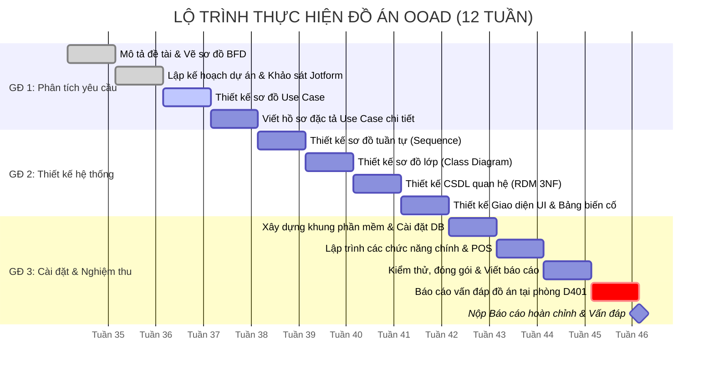

# BÀI THỰC HÀNH 2 (BTH2): KẾ HOẠCH DỰ ÁN & BẢNG KHẢO SÁT YÊU CẦU PHẦN MỀM

**Môn học:** Phân tích thiết kế hướng đối tượng (OOAD) - SGU HK1 NH2025-2026  
**Tên đề tài:** Hệ thống Quản lý Cụm Sân Thể Thao và Đặt Sân Trực Tuyến  

---

## PHẦN 1: KẾ HOẠCH THỰC HIỆN DỰ ÁN (PROJECT SCHEDULE & GANTT)

### 1.1. Lộ trình 12 tuần bám sát chương trình đào tạo SGU

### 1.2. Bảng phân bổ chi tiết công việc 12 tuần

| Tuần | Hạng mục công việc | Sản phẩm đầu ra (Deliverables) |
| :---: | :--- | :--- |
| **Tuần 1** | Viết mô tả đề tài & Vẽ mô hình phân rã chức năng BFD | Bản mô tả nghiệp vụ, Sơ đồ BFD chuẩn |
| **Tuần 2** | Lập kế hoạch 12 tuần & Bảng câu hỏi khảo sát Jotform | Kế hoạch Gantt, Link khảo sát người chơi/chủ sân |
| **Tuần 3** | Xác định Actor & Thiết kế sơ đồ Use Case tổng thể/chi tiết | Sơ đồ Use Case Diagram hoàn chỉnh |
| **Tuần 4** | Viết hồ sơ đặc tả Use Case chi tiết cho từng chức năng | Tài liệu đặc tả Use Case chuẩn |
| **Tuần 5** | Thiết kế sơ đồ tuần tự (Sequence Diagram) các ca chính | Sơ đồ Sequence Diagram (Check-in, Thuê đồ, Đặt sân) |
| **Tuần 6** | Thiết kế sơ đồ lớp đối tượng (Class Diagram) & Bảng mô tả | Sơ đồ lớp, Bảng mô tả chi tiết thuộc tính & phương thức |
| **Tuần 7** | Thiết kế Cơ sở dữ liệu quan hệ (RDM) chuẩn 3NF | Lược đồ CSDL quan hệ, Bảng từ điển dữ liệu (Data Dict) |
| **Tuần 8** | Thiết kế Giao diện (Mockup UI) & Bảng mô tả biến cố | Bản thiết kế màn hình, Bảng mô tả UI & Biến cố Event |
| **Tuần 9** | Xây dựng khung kiến trúc phần mềm & CSDL thực tế | CSDL chạy trên SQL Server/MySQL, Backend Core |
| **Tuần 10**| Lập trình chức năng đặt sân, vận hành lễ tân & POS | Các màn hình nghiệp vụ chính hoạt động được |
| **Tuần 11**| Hoàn thiện báo cáo, Poster A4, Thử nghiệm kịch bản live-code | File báo cáo hoàn chỉnh, Source code sạch, Poster A4 |
| **Tuần 12**| **Báo cáo vấn đáp đồ án & Nộp toàn bộ sản phẩm** | **Demo chương trình trên laptop & Nộp báo cáo cuối kỳ** |

---

### 1.3. Bảng phân định trách nhiệm & Vai trò đảm nhiệm (Đồ án cá nhân)

Do đồ án được thực hiện độc lập bởi **01 sinh viên**, người thực hiện sẽ đảm nhiệm toàn diện các vai trò trong vòng đời phát triển phần mềm (SDLC):

| Nhóm nhiệm vụ / Giai đoạn | Vai trò kỹ thuật đảm nhiệm | Mục tiêu & Cam kết chất lượng |
| :--- | :--- | :--- |
| **Khảo sát hiện trạng & Lập kế hoạch** | Business Analyst (BA) / Project Manager | Khảo sát nhu cầu thực tế bằng Jotform, phân rã BFD rõ ràng, lập tiến độ 12 tuần khả thi |
| **Mô hình hóa Use Case & Đặc tả** | System Analyst (SA) | Xác định đủ tác nhân (Actor), phân rã Use Case theo từng phân hệ, viết kịch bản đặc tả chuẩn |
| **Thiết kế Hướng đối tượng** | Software Architect | Xây dựng Sequence Diagram chuẩn thông điệp, thiết kế Class Diagram đảm bảo tính kế thừa, đa hình |
| **Thiết kế Cơ sở dữ liệu** | Database Designer (DBA) | Chuẩn hóa lược đồ quan hệ đạt chuẩn 3NF, thiết lập đầy đủ khóa chính/ngoại, ràng buộc toàn vẹn |
| **Thiết kế Giao diện & Biến cố** | UI/UX Designer | Thiết kế Prototype/Mockup trực quan, lập bảng mô tả biến cố tương tác (Events) chi tiết |
| **Lập trình & Phát triển phần mềm** | Fullstack Developer | Cài đặt CSDL, lập trình Backend API/Business Logic & Frontend UI hoàn thiện các ca sử dụng |
| **Kiểm thử & Đóng gói sản phẩm** | QA / QC Engineer | Viết kịch bản kiểm thử, test các trường hợp biên, chuẩn bị môi trường và dữ liệu mẫu |
| **Vấn đáp & Báo cáo tại D401** | Presenter / Technical Lead | Tự tin thuyết trình, demo phần mềm trôi chảy và sẵn sàng live-code theo yêu cầu của hội đồng |

---

## PHẦN 2: BẢNG CÂU HỎI KHẢO SÁT YÊU CẦU PHẦN MỀM (DÙNG CHO JOTFORM)

Để xây dựng hệ thống sát với thực tế, bảng khảo sát được thiết kế trên **Jotform.com** nhắm vào 2 nhóm đối tượng:
1. **Nhóm A: Khách hàng (Người chơi thể thao / Trưởng nhóm CLB)**
2. **Nhóm B: Chủ sân / Quản lý / Nhân viên lễ tân**

---

### BẢNG KHẢO SÁT NHÓM A: DÀNH CHO KHÁCH HÀNG & NGƯỜI CHƠI THỂ THAO

#### Phần 1: Thông tin chung
* **Câu 1:** Bạn thường chơi môn thể thao nào? *(Chọn nhiều lựa chọn)*
  - [ ] Cầu lông
  - [ ] Pickleball
  - [ ] Bóng đá mini (Futsal / Sân 5-7)
  - [ ] Tennis / Bóng bàn
  - [ ] Khác: ___________________
* **Câu 2:** Tần suất bạn thuê sân thể thao để chơi là bao nhiêu?
  - ( ) 1 - 2 lần / tháng (Thỉnh thoảng vãng lai)
  - ( ) 1 - 2 lần / tuần
  - ( ) 3 - 5 lần / tuần (Chơi cố định theo nhóm/CLB)
  - ( ) Hàng ngày

#### Phần 2: Thói quen và Bất cập khi đặt sân hiện tại
* **Câu 3:** Bạn thường đặt sân qua phương thức nào?
  - ( ) Gọi điện thoại trực tiếp cho chủ sân / lễ tân
  - ( ) Nhắn tin qua Zalo / Facebook Messenger
  - ( ) Đến trực tiếp sân xem có chỗ trống không
  - ( ) Dùng ứng dụng / website đặt sân trực tuyến
* **Câu 4:** Những khó khăn lớn nhất bạn gặp phải khi đặt sân theo cách hiện tại? *(Đánh giá từ 1 - Hoàn toàn không, đến 5 - Rất khó khăn)*
  - Không biết trước sân nào đang còn trống khung giờ mình cần [1] [2] [3] [4] [5]
  - Chủ sân trả lời tin nhắn/điện thoại chậm, mất cơ hội đặt giờ đẹp [1] [2] [3] [4] [5]
  - Từng bị trùng lịch (đến nơi thì sân đã có người khác đang chơi) [1] [2] [3] [4] [5]
  - Bất tiện khi phải chuyển khoản đặt cọc thủ công và gửi ảnh bill xác nhận [1] [2] [3] [4] [5]

#### Phần 3: Kỳ vọng vào Hệ thống Đặt Sân Trực Tuyến mới
* **Câu 5:** Những tính năng nào sau đây là **QUAN TRỌNG NHẤT** đối với bạn? *(Xếp hạng từ 1 đến 5)*
  - [ ] Xem sơ đồ lịch trống trực quan theo từng sân và khung giờ
  - [ ] Thanh toán cọc trực tuyến và nhận mã QR check-in vào sân ngay
  - [ ] Tính năng đăng ký lịch cố định theo tháng cho đội/CLB với giá ưu đãi
  - [ ] Dễ dàng hủy lịch hoặc đổi sân trước giờ chơi theo chính sách rõ ràng
  - [ ] Tích điểm hội viên đổi giờ chơi miễn phí hoặc giảm giá nước uống
* **Câu 6:** Khi đặt sân trực tuyến, bạn sẵn sàng đặt cọc trước bao nhiêu phần trăm?
  - ( ) 20% - 30% tổng tiền giờ
  - ( ) 50% tổng tiền giờ
  - ( ) Thanh toán 100% toàn bộ
  - ( ) Không muốn cọc trước, chỉ muốn thanh toán khi đến sân
* **Câu 7:** Ý kiến đóng góp thêm để trải nghiệm đặt sân của bạn được thuận tiện nhất:
  - *(Văn bản mở)*: ___________________________________________________________

---

### BẢNG KHẢO SÁT NHÓM B: DÀNH CHO CHỦ SÂN, QUẢN LÝ VÀ NHÂN VIÊN LỄ TÂN

#### Phần 1: Thông tin quy mô cơ sở
* **Câu 1:** Quy mô cụm sân của bạn hiện tại:
  - ( ) Dưới 4 sân
  - ( ) Từ 4 - 8 sân
  - ( ) Từ 9 - 15 sân
  - ( ) Trên 15 sân (Khu phức hợp thể thao đa năng)
* **Câu 2:** Bạn đang quản lý việc đặt sân và bán hàng bằng công cụ nào?
  - ( ) Sổ sách ghi chép bằng tay
  - ( ) File Excel / Google Sheets
  - ( ) Phần mềm quản lý bán hàng thông thường (KiotViet, Sapo...)
  - ( ) Phần mềm chuyên biệt cho sân thể thao

#### Phần 2: Nghiệp vụ vận hành và Khó khăn quản lý
* **Câu 3:** Tỷ lệ lấp đầy sân (Occupancy Rate) trong ngày của bạn như thế nào?
  - Giờ thấp điểm (Sáng & Đầu giờ chiều): ( ) Dưới 30% | ( ) 30% - 50% | ( ) Trên 50%
  - Giờ cao điểm (17h - 22h & Cuối tuần): ( ) 70% - 80% | ( ) 90% - 100% (Quá tải)
* **Câu 4:** Các vấn đề gây đau đầu nhất trong vận hành hàng ngày:
  - [ ] Khách đặt miệng qua điện thoại rồi "bùng kèo" không đến, để trống sân giờ đẹp
  - [ ] Nhân viên ghi nhầm giờ, dẫn đến 2 nhóm khách tranh chấp 1 sân
  - [ ] Khách chơi lố giờ nhưng lễ tân quên tính thêm tiền phụ thu
  - [ ] Thất thoát doanh thu từ nước uống và cho thuê vợt/bóng do ghi chép thiếu
  - [ ] Mất nhiều thời gian đối soát tiền chuyển khoản qua ngân hàng cuối ngày

#### Phần 3: Yêu cầu chức năng đối với Phần mềm Quản lý mới
* **Câu 5:** Tính năng nào sẽ giúp tối ưu hóa công việc của bạn nhất?
  - [ ] Màn hình Dashboard trực quan đổi màu theo trạng thái (Trống - Đã đặt - Đang chơi - Quá giờ)
  - [ ] Khóa slot tự động khi khách đang thao tác để chống trùng lịch tuyệt đối
  - [ ] Tích hợp máy in hóa đơn POS tại quầy cộng dồn tiền sân + tiền nước + phụ thu
  - [ ] Cấu hình bảng giá linh hoạt theo giờ vàng (Peak-hour pricing) và ngày lễ
  - [ ] Báo cáo doanh thu tự động theo ca làm việc của từng nhân viên thu ngân
* **Câu 6:** Mức phí hoặc hình thức phụ thu quá giờ bạn đang áp dụng:
  - ( ) Miễn phí nếu dưới 10 phút, quá 15 phút tính nửa giờ
  - ( ) Quá 10 phút tính tròn thành 30 phút tiền sân
  - ( ) Tính chính xác theo từng phút quá giờ
* **Câu 7:** Đề xuất tính năng đặc thù khác mà phần mềm cần có:
  - *(Văn bản mở)*: ___________________________________________________________
