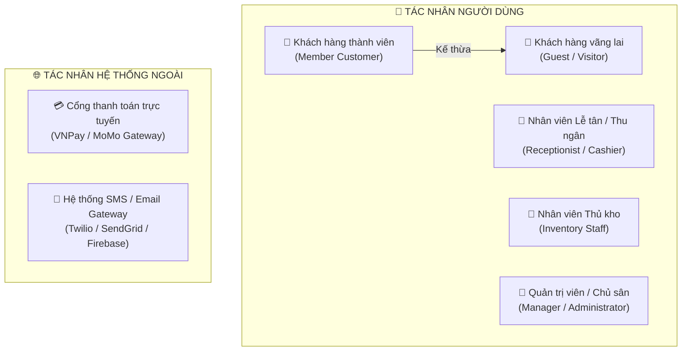
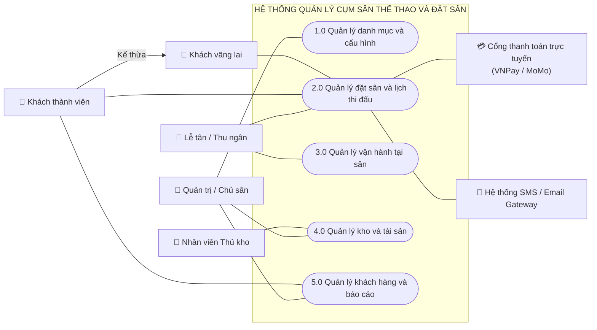
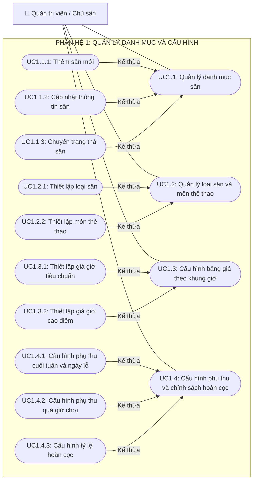
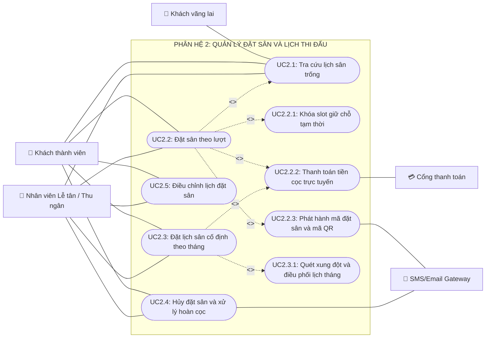
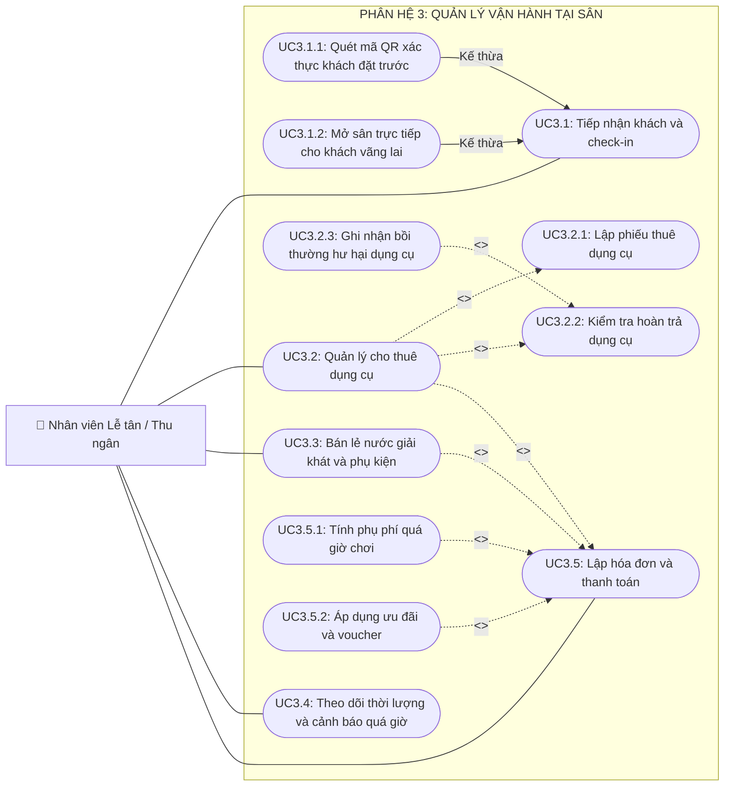
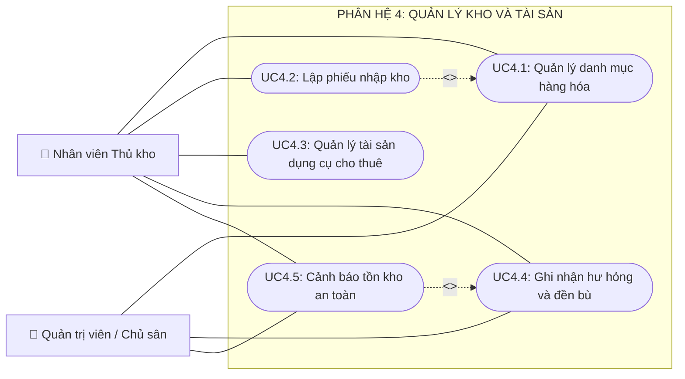
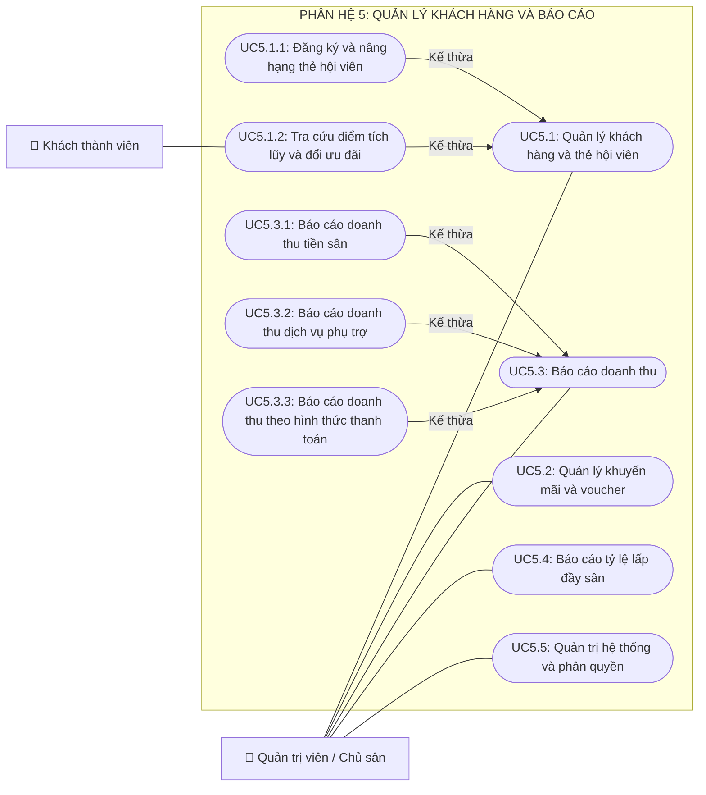

# BÀI THỰC HÀNH 3 (BTH3): SƠ ĐỒ CA SỬ DỤNG (USE CASE DIAGRAM)

**Môn học:** Phân tích thiết kế hướng đối tượng (OOAD) - SGU HK1 NH2025-2026  
**Tên đề tài:** Hệ thống Quản lý Cụm Sân Thể Thao và Đặt Sân Trực Tuyến  
*(Sports Complex Management & Online Court Booking System)*  

---

## PHẦN 1: XÁC ĐỊNH VÀ MÔ TẢ CÁC TÁC NHÂN (ACTORS)

Hệ thống bao gồm **5 tác nhân người dùng (Human Actors)** và **2 tác nhân hệ thống bên ngoài (External System Actors)**:

### Bảng mô tả chi tiết vai trò của các Tác nhân:

| STT | Tác nhân (Actor) | Phân loại | Mô tả vai trò và trách nhiệm trong hệ thống |
| :---: | :--- | :---: | :--- |
| **1** | **Khách hàng vãng lai** *(Guest)* | Primary Actor | Người dùng chưa đăng nhập, chỉ có quyền tra cứu thông tin cụm sân, xem bảng giá theo giờ và kiểm tra lưới khung giờ còn trống (Timeline Grid). |
| **2** | **Khách hàng thành viên** *(Member Customer)* | Primary Actor *(Kế thừa Guest)* | Người chơi đã có tài khoản định danh, có thể đặt sân theo lượt, đăng ký lịch cố định theo tháng, thanh toán tiền cọc trực tuyến, nhận mã QR check-in, quản lý lịch sử đặt chỗ, hủy/đổi lịch và tích lũy điểm thưởng hội viên. |
| **3** | **Nhân viên Lễ tân / Thu ngân** *(Receptionist)* | Primary Actor | Người trực tiếp vận hành tại quầy: Quét mã QR check-in tiếp nhận khách, gán sân trực tiếp cho khách vãng lai tại chỗ, lập phiếu cho thuê dụng cụ thể thao (vợt/bóng), bán lẻ nước uống/phụ kiện, theo dõi cảnh báo lố giờ và lập hóa đơn thanh toán tổng hợp POS. |
| **4** | **Nhân viên Thủ kho** *(Inventory Staff)* | Primary Actor | Quản lý kho hàng hóa và tài sản: Tiếp nhận nhập kho nước uống/phụ kiện, theo dõi số lượng và tình trạng hư hỏng của dụng cụ cho thuê, lập phiếu kiểm kê và nhận cảnh báo khi tồn kho chạm mức tối thiểu. |
| **5** | **Quản trị viên / Chủ sân** *(Manager / Admin)* | Primary Actor | Người có quyền cao nhất: Thiết lập danh mục sân/loại sân/môn thể thao, cấu hình bảng giá ma trận (Giờ thường vs Giờ cao điểm, Ngày thường vs Cuối tuần/Lễ), cấu hình phụ thu & tỷ lệ hoàn cọc, quản lý nhân viên, phân quyền và theo dõi các báo cáo thống kê kinh doanh (Doanh thu, Tỷ lệ lấp đầy sân). |
| **6** | **Cổng thanh toán điện tử** *(Payment Gateway)* | Secondary Actor | Hệ thống bên thứ 3 (VNPay, MoMo, VietQR) chịu trách nhiệm xử lý các giao dịch thanh toán tiền cọc trực tuyến và trả về mã xác thực giao dịch (`Transaction_ID`) cho hệ thống. |
| **7** | **Hệ thống SMS/Email Gateway** | Secondary Actor | Dịch vụ gửi thông báo tự động (Mã OTP xác thực, Thông tin đặt sân thành công kèm mã QR check-in, Lời nhắc lịch chơi trước 2 tiếng). |

---

## PHẦN 2: SƠ ĐỒ USE CASE TỔNG THỂ HỆ THỐNG (SYSTEM OVERVIEW USE CASE DIAGRAM)

Sơ đồ tổng quan thể hiện sự phân bổ chức năng giữa 5 nhóm tác nhân chính và 5 phân hệ nghiệp vụ cốt lõi của hệ thống:

---

## PHẦN 3: SƠ ĐỒ USE CASE CHI TIẾT THEO TỪNG PHÂN HỆ

---

### 3.1. Phân hệ 1: Quản lý Danh mục và Cấu hình

Phân hệ này dành riêng cho **Quản trị viên / Chủ sân** nhằm thiết lập toàn bộ quy tắc vận hành và định giá cho cụm sân.

---

### 3.2. Phân hệ 2: Quản lý Đặt sân và Lịch thi đấu

Đây là phân hệ cốt lõi phục vụ **Khách hàng** đặt chỗ trực tuyến và **Lễ tân** xử lý giữ chỗ. Phân hệ tích hợp cơ chế chống trùng lịch (Khóa slot giữ chỗ tạm thời) và liên kết với Cổng thanh toán & SMS Gateway.

---

### 3.3. Phân hệ 3: Quản lý Vận hành tại sân

Phân hệ dành cho **Nhân viên Lễ tân / Thu ngân** thao tác trực tiếp tại quầy để đón khách, cung cấp dịch vụ phụ trợ và thu tiền.

---

### 3.4. Phân hệ 4: Quản lý Kho và Tài sản

Phân hệ phục vụ **Nhân viên Thủ kho** và **Chủ sân** theo dõi số lượng tồn kho nước uống và tài sản vợt/bóng cho thuê.

---

### 3.5. Phân hệ 5: Quản lý Khách hàng và Báo cáo

Phân hệ dành cho **Quản trị viên** theo dõi hiệu quả kinh doanh và quản lý người dùng, đồng thời cho phép **Khách hàng** quản lý thông tin hội viên.

---

## PHẦN 4: BẢNG PHÂN TÍCH QUAN HỆ GIỮA CÁC USE CASE

### 4.1. Bảng phân tích quan hệ `<<include>>` (Bắt buộc dùng chung)

| Base Use Case (UC gốc) | Included Use Case (UC được gọi) | Lý do nghiệp vụ bắt buộc |
| :--- | :--- | :--- |
| **UC2.2: Đặt sân theo lượt** | `UC2.1: Tra cứu lịch sân trống` | Khách hàng bắt buộc phải xem lịch trống mới có thể chọn sân và khung giờ phù hợp. |
| **UC2.2: Đặt sân theo lượt** | `UC2.2.1: Khóa slot giữ chỗ tạm thời` | Khi khách chọn sân, hệ thống lập tức khóa slot để đảm bảo không ai khác đặt trùng. |
| **UC2.2: Đặt sân theo lượt** | `UC2.2.2: Thanh toán tiền cọc trực tuyến` | Đơn đặt sân chỉ có hiệu lực khi khách hoàn tất đặt cọc qua cổng thanh toán. |
| **UC2.2: Đặt sân theo lượt** | `UC2.2.3: Phát hành mã đặt sân và mã QR` | Sau khi cọc thành công, hệ thống bắt buộc tạo mã định danh và mã QR để khách check-in tại sân. |
| **UC2.3: Đặt lịch sân cố định theo tháng** | `UC2.3.1: Quét xung đột và điều phối lịch tháng` | Đặt lịch định kỳ bắt buộc phải quét toàn bộ các tuần trong tháng để phát hiện các ngày bị trùng lịch. |
| **UC2.3: Đặt lịch sân cố định theo tháng** | `UC2.2.2: Thanh toán tiền cọc trực tuyến` | Đơn đặt lịch tháng bắt buộc thanh toán tiền cọc định kỳ. |
| **UC3.2: Quản lý cho thuê dụng cụ** | `UC3.2.1: Lập phiếu thuê dụng cụ` | Khi khách có nhu cầu mượn vợt/bóng phải lập phiếu thuê xác nhận. |
| **UC3.2: Quản lý cho thuê dụng cụ** | `UC3.2.2: Kiểm tra hoàn trả dụng cụ` | Khi khách trả đồ nhân viên phải kiểm tra hiện trạng thiết bị. |
| **UC3.5: Lập hóa đơn và thanh toán** | `UC3.2: Quản lý cho thuê dụng cụ` *(nếu có)* | Hóa đơn thanh toán khi trả sân phải cộng dồn toàn bộ tiền thuê vợt/bóng chưa thanh toán. |
| **UC3.5: Lập hóa đơn và thanh toán** | `UC3.3: Bán lẻ nước giải khát và phụ kiện` *(nếu có)* | Hóa đơn thanh toán phải cộng dồn các mặt hàng nước uống/phụ kiện khách đã dùng trong ca chơi. |
| **UC4.2: Lập phiếu nhập kho** | `UC4.1: Quản lý danh mục hàng hóa` | Nhập kho bắt buộc phải chọn từ danh mục hàng hóa đã định nghĩa. |

---

### 4.2. Bảng phân tích quan hệ `<<extend>>` (Mở rộng có điều kiện)

| Base Use Case (UC gốc) | Extension Use Case (UC mở rộng) | Điểm mở rộng (Extension Point) | Điều kiện kích hoạt mở rộng |
| :--- | :--- | :--- | :--- |
| **UC3.5: Lập hóa đơn và thanh toán** | `UC3.5.1: Tính phụ phí quá giờ chơi` | `At_Overtime_Calculation` | Khi thời gian khách trả sân vượt quá 15 phút so với giờ kết thúc đăng ký ban đầu. |
| **UC3.5: Lập hóa đơn và thanh toán** | `UC3.5.2: Áp dụng ưu đãi và voucher` | `At_Discount_Application` | Khi khách hàng xuất trình mã Voucher hợp lệ hoặc là Hội viên đạt hạng VIP/Gold. |
| **UC3.2.2: Kiểm tra hoàn trả dụng cụ** | `UC3.2.3: Ghi nhận bồi thường hư hại dụng cụ` | `At_Equipment_Damage_Check` | Khi nhân viên phát hiện vợt bị gãy cán, nứt khung hoặc làm mất bóng thi đấu. |
| **UC4.4: Ghi nhận hư hỏng và đền bù** | `UC4.5: Cảnh báo tồn kho an toàn` | `At_Stock_Threshold_Check` | Khi ghi nhận hư hại/hao hụt làm số lượng tồn kho giảm xuống dưới định mức an toàn quy định. |

---

### 4.3. Bảng phân tích quan hệ Kế thừa (Generalization)

* **Kế thừa giữa các Actor:**
  * `Khách hàng thành viên (Member Customer)` **kế thừa** `Khách hàng vãng lai (Guest)`: Kế thừa toàn bộ quyền xem lịch trống, xem giá và được bổ sung thêm quyền đặt chỗ, nạp cọc, tích điểm.
* **Kế thừa giữa các Use Case:**
  * `UC1.1.1: Thêm sân mới`, `UC1.1.2: Cập nhật thông tin sân`, `UC1.1.3: Chuyển trạng thái sân` kế thừa từ `UC1.1: Quản lý danh mục sân`.
  * `UC1.2.1: Thiết lập loại sân`, `UC1.2.2: Thiết lập môn thể thao` kế thừa từ `UC1.2: Quản lý loại sân và môn thể thao`.
  * `UC1.3.1: Thiết lập giá giờ tiêu chuẩn`, `UC1.3.2: Thiết lập giá giờ cao điểm` kế thừa từ `UC1.3: Cấu hình bảng giá theo khung giờ`.
  * `UC1.4.1: Cấu hình phụ thu cuối tuần và ngày lễ`, `UC1.4.2: Cấu hình phụ thu quá giờ chơi`, `UC1.4.3: Cấu hình tỷ lệ hoàn cọc` kế thừa từ `UC1.4: Cấu hình phụ thu và chính sách hoàn cọc`.
  * `UC3.1.1: Quét mã QR xác thực khách đặt trước` và `UC3.1.2: Mở sân trực tiếp cho khách vãng lai` kế thừa từ `UC3.1: Tiếp nhận khách và check-in`.
  * `UC5.1.1: Đăng ký và nâng hạng thẻ hội viên`, `UC5.1.2: Tra cứu điểm tích lũy và đổi ưu đãi` kế thừa từ `UC5.1: Quản lý khách hàng và thẻ hội viên`.
  * `UC5.3.1: Báo cáo doanh thu tiền sân`, `UC5.3.2: Báo cáo doanh thu dịch vụ phụ trợ`, `UC5.3.3: Báo cáo doanh thu theo hình thức thanh toán` kế thừa từ `UC5.3: Báo cáo doanh thu`.

---

## PHẦN 5: MA TRẬN PHÂN QUYỀN ACTOR - USE CASE (ACCESS CONTROL MATRIX)

Bảng ma trận thể hiện quyền truy cập và thực thi của từng vai trò (Role) đối với toàn bộ 24 Use Case chính trong hệ thống:

| Mã UC | Tên Use Case | Khách vãng lai | Khách thành viên | Lễ tân / Thu ngân | Thủ kho | Quản trị / Chủ sân |
| :---: | :--- | :---: | :---: | :---: | :---: | :---: |
| **UC1.1** | Quản lý danh mục sân | | | | | **X** |
| **UC1.2** | Quản lý loại sân và môn thể thao | | | | | **X** |
| **UC1.3** | Cấu hình bảng giá theo khung giờ | | | | | **X** |
| **UC1.4** | Cấu hình phụ thu và chính sách hoàn cọc | | | | | **X** |
| **UC2.1** | Tra cứu lịch sân trống | **X** | **X** | **X** | | **X** |
| **UC2.2** | Đặt sân theo lượt | | **X** | **X** | | **X** |
| **UC2.3** | Đặt lịch sân cố định theo tháng | | **X** | **X** | | **X** |
| **UC2.4** | Hủy đặt sân và xử lý hoàn cọc | | **X** | **X** | | **X** |
| **UC2.5** | Điều chỉnh lịch đặt sân | | **X** | **X** | | **X** |
| **UC3.1** | Tiếp nhận khách và check-in | | | **X** | | **X** |
| **UC3.2** | Quản lý cho thuê dụng cụ | | | **X** | | **X** |
| **UC3.3** | Bán lẻ nước giải khát và phụ kiện | | | **X** | | **X** |
| **UC3.4** | Theo dõi thời lượng và cảnh báo quá giờ | | | **X** | | **X** |
| **UC3.5** | Lập hóa đơn và thanh toán | | | **X** | | **X** |
| **UC4.1** | Quản lý danh mục hàng hóa | | | | **X** | **X** |
| **UC4.2** | Lập phiếu nhập kho | | | | **X** | **X** |
| **UC4.3** | Quản lý tài sản dụng cụ cho thuê | | | | **X** | **X** |
| **UC4.4** | Ghi nhận hư hỏng và đền bù | | | | **X** | **X** |
| **UC4.5** | Cảnh báo tồn kho an toàn | | | | **X** | **X** |
| **UC5.1** | Quản lý khách hàng và thẻ hội viên | | **X** *(Xem điểm)* | **X** *(Tra cứu)* | | **X** *(Toàn quyền)* |
| **UC5.2** | Quản lý khuyến mãi và voucher | | **X** *(Xem)* | **X** *(Áp dụng)* | | **X** *(Tạo mới)* |
| **UC5.3** | Báo cáo doanh thu | | | **X** *(Theo ca)* | | **X** *(Toàn bộ)* |
| **UC5.4** | Báo cáo tỷ lệ lấp đầy sân | | | | | **X** |
| **UC5.5** | Quản trị hệ thống và phân quyền | | | | | **X** |

---

## PHẦN 6: ĐỐI CHIẾU TIÊU CHÍ CHẤM ĐIỂM OOAD SGU (BTH3)

1. **Tính đầy đủ và bao phủ (Completeness):** Sơ đồ Use Case bao phủ 100% các chức năng đã phân rã trong BFD (BTH1), không bỏ sót bất kỳ quy trình nào từ khảo sát BTH2.
2. **Tính chuẩn xác của ký pháp UML (Syntactic Correctness):**
   * Sử dụng đúng quan hệ `<<include>>` (mũi tên đứt nét trỏ từ UC chính sang UC bắt buộc).
   * Sử dụng đúng quan hệ `<<extend>>` (mũi tên đứt nét trỏ từ UC mở rộng về UC chính kèm Extension Point).
   * Phân biệt rõ ràng Actor chính (Human) và Actor phụ (Hệ thống cổng thanh toán / SMS).
3. **Tính sẵn sàng cho BTH4 (Đặc tả Use Case):** Danh sách 24 Use Case chính này là đầu vào trực tiếp để lựa chọn và viết đặc tả chi tiết trong BTH4.
